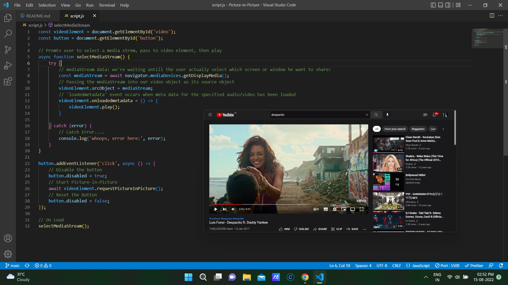

# Picture-in-Picture [[link](https://prasenjitjs3.netlify.app/)]
The Picture-in-Picture API allow websites to create a floating video window always on top of other windows so that users may continue consuming media while they interact with other content sites, or applications on their device..

Tech Stack: HTML, CSS, Vanilla Js, [Screen Capture API](https://developer.mozilla.org/en-US/docs/Web/API/Screen_Capture_API/Using_Screen_Capture), [Picture-in-Picture](https://developer.mozilla.org/en-US/docs/Web/API/Picture-in-Picture_API)

****HOW TO USE***: 
  Step-1: select Entire Screen/ Window / a Tab.
  step-2: click on Share button
  Step-3: Get back to the tab where application is running
  step-4: click on START

  

HOW IT WORKS:
  * The Screen-Capture-api allowa us to capture live screen contents in form of media stream
  * Then we pass the media stream to the video element as source object.
  * Now we'll listen for `loadedmetadata` event on that video object. The event occurs when meta data (like  
    dimensions and duration) are loaded.
  * Once loading was finished, call play() method on video object to play the video.

  *********************************** First Step Done *********************************
  * next target: Bypass the video object altogether and have the `start` button to launch Picture-in-Picture
                 functionality.

  * On the `click` event on START button, we disabled the button and call requestPictureInPicture() method
    on the video element 
  
  * Untill the video is playing in Picture-in-Picture mode, we wait for the promise to resolve.

  * Once the user close picture-in-picture mode, the promise is resolved.
  
  * Then we enable the START button again.